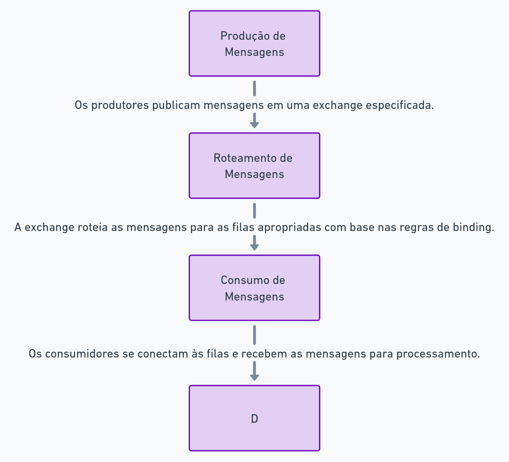

### Visão Geral do RabbitMQ

#### O que é RabbitMQ

RabbitMQ é um sistema de mensageria open-source que implementa o protocolo AMQP (Advanced Message Queuing Protocol). Foi desenvolvido pela empresa Pivotal Software e é amplamente utilizado em sistemas distribuídos para permitir a comunicação assíncrona entre diferentes componentes de software. O RabbitMQ é conhecido por sua robustez, flexibilidade e facilidade de uso, tornando-se uma escolha popular para desenvolvedores e arquitetos de sistemas que necessitam de uma solução confiável para troca de mensagens.

O RabbitMQ oferece uma série de funcionalidades que facilitam a implementação de padrões de design como Pub/Sub (Publicação/Assinatura), Filas de Trabalho, RPC (Remote Procedure Call), entre outros. Além disso, suporta vários protocolos de mensageria, integra-se facilmente com diversas linguagens de programação e pode ser executado em múltiplas plataformas, incluindo Windows, macOS e Linux.

#### Arquitetura Básica

A arquitetura do RabbitMQ é baseada em alguns conceitos fundamentais que garantem a flexibilidade e eficiência do sistema. Esses conceitos incluem Exchanges, Queues, Bindings e Mensagens.

1. **Exchanges**
   - As exchanges são responsáveis por receber mensagens de produtores e encaminhá-las para as filas (queues) apropriadas com base em regras de roteamento. Existem diferentes tipos de exchanges, cada uma com seu próprio comportamento de roteamento:
     - **Direct Exchange**: Encaminha mensagens para as filas com base em uma chave de roteamento exata.
     - **Fanout Exchange**: Encaminha mensagens para todas as filas ligadas a ela, sem considerar qualquer chave de roteamento.
     - **Topic Exchange**: Encaminha mensagens para as filas com base em padrões de chaves de roteamento (wildcards).
     - **Headers Exchange**: Encaminha mensagens com base em cabeçalhos específicos em vez de chaves de roteamento.

2. **Queues**
   - As filas são onde as mensagens são armazenadas até serem consumidas pelos consumidores. Elas podem ser configuradas para ser duráveis (persistem após a reinicialização do RabbitMQ), temporárias (existem apenas enquanto a conexão que as declarou está ativa) ou exclusivas (somente o criador pode acessá-las).

3. **Bindings**
   - Bindings são as regras que ligam exchanges a filas. Eles determinam quais mensagens enviadas para uma exchange devem ser encaminhadas para uma fila específica com base nas chaves de roteamento ou cabeçalhos.

4. **Mensagens**
   - As mensagens são os dados que os produtores enviam para as exchanges. Elas contêm um payload (conteúdo da mensagem) e metadados (como propriedades de cabeçalho, chave de roteamento, etc.). As mensagens podem ser persistentes ou transitórias, dependendo das necessidades de durabilidade do sistema.

#### Componentes Adicionais

Além dos componentes básicos, o RabbitMQ oferece várias outras funcionalidades e componentes que aprimoram sua capacidade e flexibilidade:

1. **Producers e Consumers**
   - **Producers**: Aplicações que enviam mensagens para o RabbitMQ. Elas publicam mensagens em exchanges.
   - **Consumers**: Aplicações que recebem mensagens das filas e as processam. Eles consomem mensagens das filas para realizar tarefas específicas.

2. **RabbitMQ Management Plugin**
   - Uma interface gráfica que permite aos usuários gerenciar e monitorar o RabbitMQ. Com ela, é possível ver estatísticas em tempo real, criar e excluir exchanges, filas e bindings, entre outras funcionalidades.

3. **Virtual Hosts (vHosts)**
   - vHosts são uma forma de segmentar o broker RabbitMQ em várias instâncias lógicas, cada uma com suas próprias filas, exchanges, bindings, usuários e permissões. Isso é útil para isolar diferentes aplicações ou ambientes dentro de um mesmo broker.

4. **Plugins**
   - RabbitMQ suporta uma variedade de plugins que adicionam funcionalidades adicionais, como Federation, Shovel, e suporte a outros protocolos de mensageria além do AMQP.

#### Funcionamento Básico

O funcionamento básico do RabbitMQ pode ser resumido nos seguintes passos:

1. **Produção de Mensagens**
   - Os produtores publicam mensagens em uma exchange especificada.
   
2. **Roteamento de Mensagens**
   - A exchange roteia as mensagens para as filas apropriadas com base nas regras de binding.

3. **Consumo de Mensagens**
   - Os consumidores se conectam às filas e recebem as mensagens para processamento.

4. **Acknowledgement (Reconhecimento)**
   - Após processar uma mensagem, o consumidor envia um reconhecimento (ack) ao RabbitMQ, indicando que a mensagem foi processada com sucesso. Se um consumidor falhar em processar uma mensagem, ela pode ser reencaminhada para processamento futuro.

   

Essa arquitetura modular e flexível permite ao RabbitMQ suportar uma ampla gama de casos de uso, desde simples filas de trabalho até complexas arquiteturas de microserviços e sistemas de processamento de eventos em tempo real.